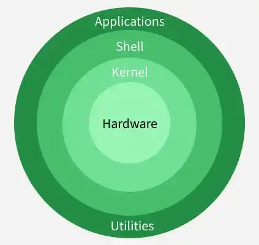
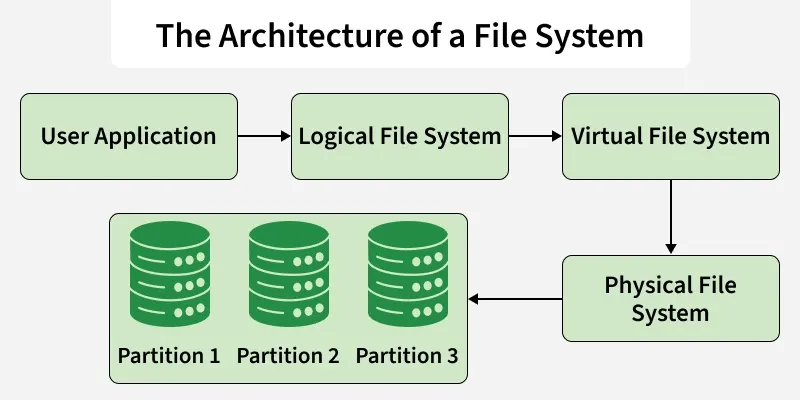
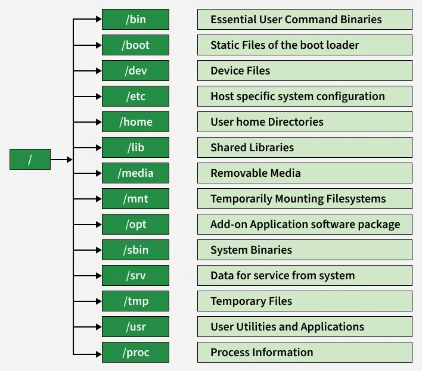

### Architecture of Linux

Linux follows a layered architecture, where each layer has a specific role and responsibility. The main components of Linux operating system are:

- **Application**
- **Shell**
- **Kernel**
- **Hardware**
- **Utilities**




---
### File System

A file system defines the structure, rules, and methods for how data is organized, stored, accessed, and managed on a storage device.

1. **Space management**
2. **Filename**
3. **Directory - maintain a hierarchical structure**
4. **Metadata**
5. **Utilities**
6. **Design**

#### Architecture of File system

Linux follows a three layered architecture.

1. **Logical layer**
- Acts as the interface between user applications and the file system.
- Handles key operations like open, read, write, and close.
- Provides security checks, such as permissions and file access control.


 2. **Virtual** **layer**
- Provides a common interface for different file systems (ext4, XFS, FAT32, NTFS, etc.).
- Allows Linux to use multiple file system types at the same time.
- Acts as an abstraction layer, hiding the internal complexities of each file system.

3. **Physical layer**
- Directly interacts with the hardware and disk storage.
- Manages data blocks, inodes, and physical memory allocation.
- Responsible for writing data to the disk and retrieving it efficiently.



---
#### Hierarchical structure



---
#### Linux File Permissions

Linux controls file access using **permissions assigned to three types of users**:

- **Owner (u)** → the user who owns the file
    
- **Group (g)** → users belonging to the file’s group
    
- **Others (o)** → all other users in the system
    

Permissions determine what actions each user type can perform on the file.

##### Permission Types

Each file has three permission types:

- **r (read)** → view file contents
    
- **w (write)** → modify or delete the file
    
- **x (execute)** → run the file as a program
    

Example:

```
rwxr-xr--
```

Meaning:

```
Owner  → read, write, execute
Group  → read, execute
Others → read only
```

##### Changing Permissions Using chmod (Symbolic Notation)

Symbolic notation uses:

```
u → user (owner)
g → group
o → others
a → all
```

Examples:

```
chmod o-rw,u-w file
```

Removes **read and write from others** and **write from owner**.

```
chmod u+x file
```

Adds **execute permission to owner**.

##### Changing Permissions Using chmod (Octal Notation)

Permissions can also be represented using numbers:

```
4 → read
2 → write
1 → execute
```

Values are added together.

Examples:

```
7 = 4+2+1 → read, write, execute
6 = 4+2   → read, write
5 = 4+1   → read, execute
4 = read only
```

Example command:

```
chmod 715 file
```

Meaning:

```
Owner  → 7 → rwx
Group  → 1 → execute
Others → 5 → read, execute
```

