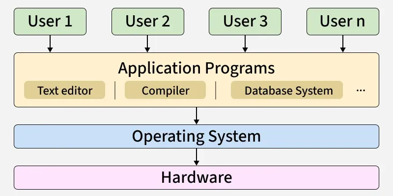
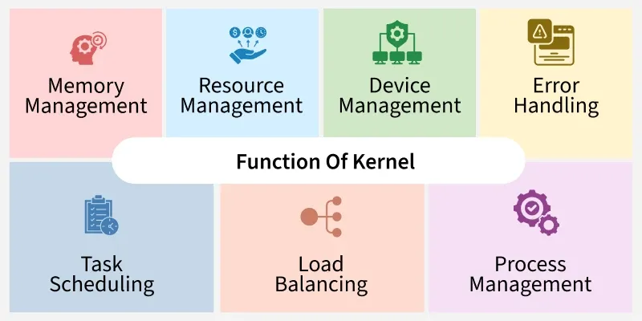
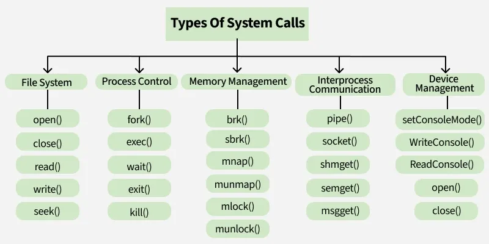

An operating system acts as an intermediary between the computer hardware and the user.

 ###### **User Interface for OS**
- Command-Line Interface (CLI), (e.g., Bash, PowerShell)
- Graphical User Interface (GUI), (e.g., Windows desktop, macOS Finder)

##### **Component of an Operating System**

There are two basic components of an Operating System.

- **Shell** is the outermost layer of the Operating System and handles user interaction. It interprets input for the OS and handles the output from the OS.
- **Kernel** is the core component of the operating system. The kernel is the primary interface between the Operating system and Hardware.

---

#### **Kernel**
 The kernel manages system resources, such as the CPU, memory and devices, ensuring everything works together smoothly and efficiently.
 

###### **Working of Kernel**

1. **Kernel Loading During Boot**

- During system boot, the **bootloader loads the kernel into RAM**.
    
- Kernel is the **first part of the OS to run in memory**.
    
- After loading, the kernel **initializes hardware and system components**.
    

2. **Kernel as Hardware Mediator**

Applications **cannot directly communicate with hardware**.

Instead:

Application → System Call → Kernel → Hardware

The kernel:

- receives requests from applications
    
- interacts with hardware
    
- returns results back to the application

This ensures **security and controlled hardware access**.

---

##### **System Calls**

User programs cannot directly access hardware or critical OS resources because it would make the system unstable and insecure. To maintain safety, the operating system provides system calls — controlled interfaces that allow user programs to request services from the kernel. These calls act as a gateway between user mode and kernel mode.

###### **How does system call works**

A system call is a controlled entry point that allows a user program to request a service from the operating system. Here's how it works:

- The user program executes a system call instruction (e.g., using syscall or int 0x80).
- The CPU switches from user mode → kernel mode for safe execution.
- The kernel identifies the system call number and performs the requested operation (file access, process creation, memory allocation, etc.).
- After completing the task, the kernel switches back to user mode.
- The result (success/failure/data) is returned to the program.
- Without system calls, every program would need its own way to access hardware, leading to inconsistent and insecure systems.

 